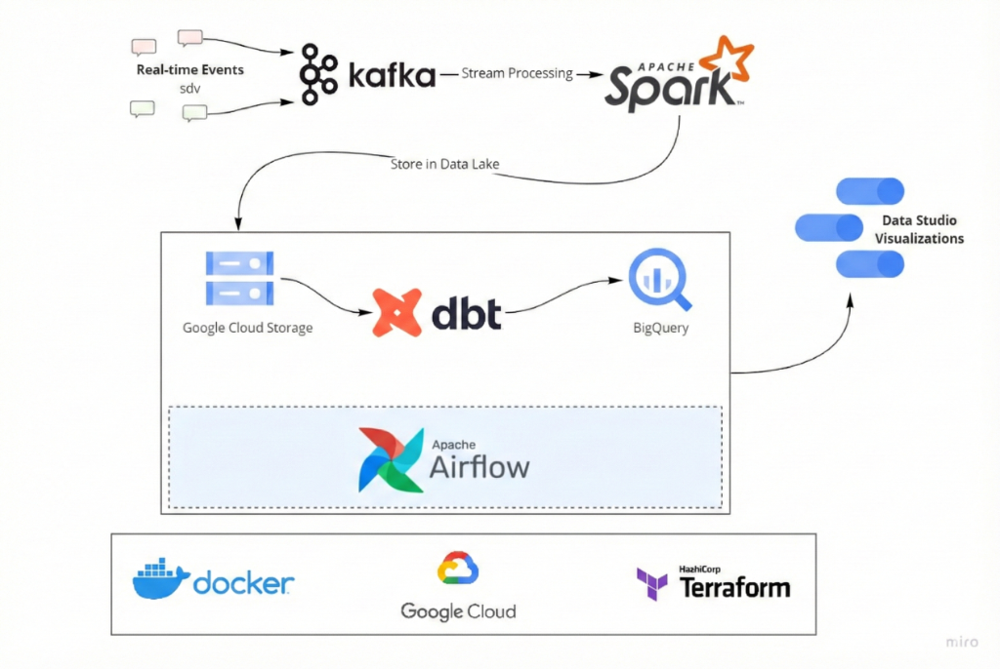

# Streamazon

A data pipeline for Amazon Sales data with Kafka, Spark Streaming, dbt, Docker, Airflow, Terraform, GCP and more!

## Description

### Objective

This project builds a real-time data pipeline for Amazon sales data. The pipeline processes e-commerce sales events including orders, products, shipping information, and promotions. The data is streamed through Kafka, processed with Spark Streaming, stored in Google Cloud Storage, and transformed using dbt to create dimension and fact tables for analytics in BigQuery.

Key analytics include:
- Sales performance by product category
- Geographic distribution of orders
- Order fulfillment efficiency
- Promotion effectiveness
- Revenue trends over time

### Dataset

The project uses **Amazon Sales Dataset** containing real e-commerce transaction data with the following attributes:
- Order information (Order ID, Date, Status)
- Product details (SKU, ASIN, Style, Category, Size)
- Shipping information (City, State, Country, Postal Code)
- Financial data (Quantity, Amount, Currency)
- Promotion IDs and B2B flags

SDV (Synthetic Data Vault) is used to generate realistic synthetic data for streaming simulation.

### Tools & Technologies

| Category | Technology |
|----------|------------|
| Cloud | [Google Cloud Platform](https://cloud.google.com) |
| Infrastructure as Code | [Terraform](https://www.terraform.io) |
| Containerization | [Docker](https://www.docker.com), [Docker Compose](https://docs.docker.com/compose/) |
| Stream Processing | [Apache Kafka](https://kafka.apache.org), [Spark Streaming](https://spark.apache.org/docs/latest/streaming-programming-guide.html) |
| Orchestration | [Apache Airflow](https://airflow.apache.org) |
| Transformation | [dbt](https://www.getdbt.com) |
| Data Lake | [Google Cloud Storage](https://cloud.google.com/storage) |
| Data Warehouse | [BigQuery](https://cloud.google.com/bigquery) |
| Data Visualization | [Looker Studio](https://lookerstudio.google.com) |
| Language | [Python](https://www.python.org) |

### Architecture



### Data Model

**Dimension Tables:**
- `dim_product` - Product information (SKU, ASIN, Style, Category, Size)
- `dim_location_amazon` - Shipping location (City, State, Country, Postal Code)
- `dim_order_details` - Order processing info (Fulfilment, Service Level, Status)
- `dim_promotion` - Promotion information

**Fact Table:**
- `fact_amazon_sales` - Sales transactions with foreign keys to dimensions

## Project Structure

```
streaming_amazon_sales/
├── airflow/                 # Airflow DAGs and configuration
│   ├── dags/               # DAG definitions
│   ├── docker-compose.yaml # Airflow Docker setup
│   └── Dockerfile
├── dbt_streamazon/         # dbt transformation models
│   ├── models/
│   │   └── core/           # Dimension and fact tables
│   └── profiles.yml
├── kafka/                   # Kafka configuration
├── sdv_amazon_stream/      # Synthetic data generator
├── spark_streaming/        # Spark streaming jobs
├── terraform/              # Infrastructure as Code
│   ├── main.tf
│   └── variables.tf
└── scripts/                # Utility scripts
```

## Setup

> ⚠️ **WARNING**: You will be charged for GCP infrastructure. New accounts get $300 free credit.

### Prerequisites

1. **Google Cloud Platform Account**
   - Create a GCP account
   - Create a new project
   - Enable required APIs (BigQuery, Cloud Storage, Compute Engine)

2. **Local Tools**
   - [gcloud CLI](https://cloud.google.com/sdk/docs/install)
   - [Terraform](https://www.terraform.io/downloads)
   - [Docker & Docker Compose](https://docs.docker.com/get-docker/)
   - Python 3.10+

3. **Authentication**
   ```bash
   gcloud auth login
   gcloud auth application-default login
   ```

### Quick Start

1. **Clone the repository**
   ```bash
   git clone https://github.com/your-username/streaming_amazon_sales.git
   cd streaming_amazon_sales
   ```

2. **Set up infrastructure with Terraform**
   ```bash
   cd terraform
   terraform init
   terraform plan
   terraform apply
   ```

3. **Start Kafka**
   ```bash
   cd kafka
   docker-compose up -d
   ```

4. **Start data streaming**
   ```bash
   cd sdv_amazon_stream
   python main.py
   ```

5. **Start Spark Streaming**
   ```bash
   cd spark_streaming
   python stream_all_events.py
   ```

6. **Start Airflow**
   ```bash
   cd airflow
   docker-compose up -d
   ```
   Access Airflow UI at http://localhost:8080 (user: airflow, password: airflow)

7. **Run dbt transformations**
   ```bash
   cd dbt_streamazon
   dbt deps
   dbt run --target prod
   ```

## Configuration

### Environment Variables

Create `.env` files in the following directories:

**airflow/.env**
```
AIRFLOW_UID=50000
GOOGLE_CREDENTIALS_PATH=/path/to/gcloud/credentials
GCP_PROJECT_ID=your-project-id
GCP_GCS_BUCKET=your-bucket-name
BIGQUERY_DATASET=streamazon_stg
```

**sdv_amazon_stream/.env**
```
KAFKA_BOOTSTRAP_SERVERS=localhost:9092
```

### Terraform Variables

Edit `terraform/terraform.tfvars`:
```hcl
project_id = "your-project-id"
region     = "us-east1"
```

## Future Improvements

- [ ] Use managed services (Cloud Composer, Confluent Cloud)
- [ ] Implement incremental loading for fact tables
- [ ] Add data quality tests with dbt tests
- [ ] Create CI/CD pipeline
- [ ] Add more comprehensive dashboards
- [ ] Implement data lineage tracking

## Acknowledgments

This project is inspired by [Streamify](https://github.com/ankurchavda/streamify) by Ankur Chavda and the [Data Engineering Zoomcamp](https://github.com/DataTalksClub/data-engineering-zoomcamp) by DataTalks.Club.

## License

This project is licensed under the MIT License.
